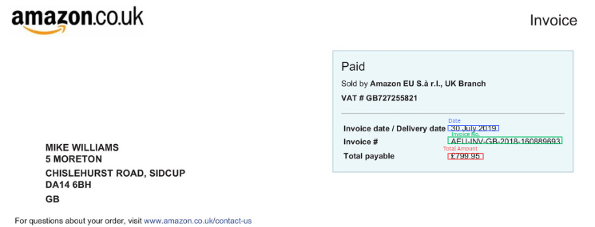
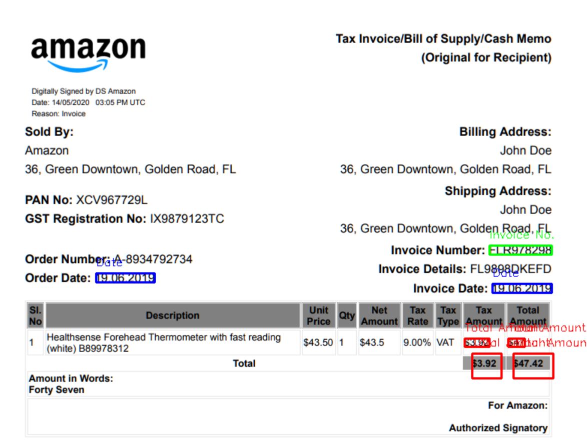
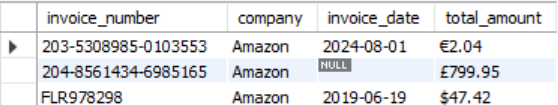

# 🧾 Invoice OCR System  

---

## 📌 Project Overview

This project is an **Optical Character Recognition (OCR)** system for invoice processing. It extracts key invoice details such as **invoice number**, **date**, and **total amount** from images and stores them in a **MySQL database**.

The system supports invoices from multiple companies (*Amazon, Flipkart, Myntra*) and prevents duplicate entries by using the invoice number as the primary key.

---

## ⚙️ Tools & Technologies Used

| Category              | Tools / Technologies                            |
|----------------------|--------------------------------------------------|
| Programming Language | Python (≥ 3.7)                                   |
| OCR Engine           | Tesseract OCR                                    |
| Database             | MySQL Server & MySQL Workbench                   |
| Libraries & Packages | OpenCV, pytesseract, regex, mysql-connector      |
| Development Tools    | VS Code, Terminal/Command Line                   |

---

## 🚀 Features

- **Invoice Image Preprocessing**: Converts images to grayscale, applies Gaussian blur, and uses thresholding for better OCR results.  
- **OCR Extraction**: Utilizes Tesseract OCR to extract invoice number, date, and total amount.  
- **Pattern Matching**: Employs regular expressions to accurately identify invoice components.  
- **Database Integration**: Saves extracted data into a MySQL database while preventing duplicates via unique invoice numbers.  
- **Visual Output**: Displays bounding boxes on detected text elements for visual verification.

---

## 🧰 Installation & Setup

### ✅ Prerequisites

Make sure the following are installed:

- Python ≥ 3.7  
- MySQL Server & MySQL Workbench  
- Tesseract OCR (installed and added to system path)  
- Required Python packages  

### 📦 Install Dependencies

```bash
pip install -r requirements.txt
```
---

## 🛠️ How to Use
### 1. Run the OCR System
sh
OCR_Packaged_Final_Multiple_Templates.py

- The script will prompt you to enter the company name (*Amazon, Flipkart, or Myntra*).
- It will process the invoice image, extract relevant details, and store them in the database.
- The extracted data will be displayed on the terminal and saved in the MySQL database.

### 2. Viewing Extracted Data
To view the stored data, open *MySQL Workbench* and run:
```sql
SELECT * FROM invoices;
```
---

## Database Schema
The extracted invoice details are stored in a MySQL table named invoices:
```sql
CREATE TABLE invoices (
    id INT AUTO_INCREMENT PRIMARY KEY,
    company VARCHAR(255),
    invoice_number VARCHAR(255) UNIQUE,
    invoice_date DATE,
    total_amount VARCHAR(50)
);
```
---

## 🖼️ Screenshots

### ✅ OCR Processed Invoice Samples

#### Amazon Invoice (Ireland)


#### Amazon Invoice (US)


### 🗃️ MySQL Database Screenshot


---

## 🚧 Future Enhancements

- Improve total amount extraction to support more currency formats.  
- Add support for additional invoice templates.  
- Build a web-based UI for uploading invoices and viewing results.

---

## 📬 Contact

For any issues or contributions, feel free to reach out or create a pull request on GitHub.
